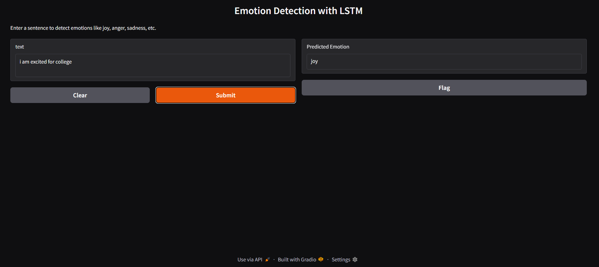

# 🧠 Text Emotion Detection using LSTM

This project predicts **emotions** like joy, sadness, anger, etc., from input text using **Natural Language Processing (NLP)** and a **deep learning LSTM model**.

It uses the [`dair-ai/emotion`](https://huggingface.co/datasets/dair-ai/emotion) dataset and includes complete preprocessing, model training, and a Gradio-based user interface.

---

## 🔥 Emotion Classes

The model classifies input into one of the following six emotions:

```
['sadness', 'joy', 'love', 'anger', 'fear', 'surprise']
```

---

## 🗂️ Project Structure

```
📁 Text_Emotion_detection/
├── prepro.ipynb            # Text preprocessing
├── emo_lstm_model.ipynb    # Model building and training
├── gradio_app.py           # Gradio UI code
├── lstm_emo_model.h5       # Trained LSTM model
├── tokenizer.pkl           # Saved tokenizer
├── label_encoder.pkl       # Saved label encoder
├── README.md               # Project documentation
├── demo.png                # Gradio demo screenshot
```

---

## ⚙️ How It Works

### ✨ Preprocessing
- Lowercase conversion
- URL and special character removal
- Tokenization
- Lemmatization
- Sequence padding

### ✨ Model Architecture
- 2-layer **Bidirectional LSTM**
- Dropout layers for regularization
- Dense softmax output for classification

### ✨ Inference
- Input text is cleaned, tokenized, padded, and passed to the model
- Predicted emotion is returned as output

---

## 🚀 Run the Gradio App

### ✅ Install dependencies:

```bash
pip install gradio tensorflow nltk
```

### ▶️ Launch the app:

```bash
python gradio_app.py
```

A browser window will open with a simple interface for emotion prediction.

---

## 🖼️ Demo Screenshot

Here’s how the Gradio interface looks:



---

## 📊 Dataset Used

- **Dataset**: [`dair-ai/emotion`](https://huggingface.co/datasets/dair-ai/emotion)
- **Total Samples**: ~20k
- **Classes**: 6 emotion categories

---

## 🛠️ Future Improvements

- Add attention mechanism
- Integrate pre-trained embeddings (like GloVe)
- Use transformer-based models like BERT
- Host the app online using Streamlit or Hugging Face Spaces

---

## 👨‍💻 Author

- **Tanmay GSN**
- GitHub: [Tanmay-gsn](https://github.com/Tanmay-gsn)

---

## 📄 License

This project is licensed under the **MIT License**.
